# Cómo jugar

Esta sección contiene todo lo necesario para preparar una partida y entender el funcionamiento básico del juego.

---

## Las fichas

Se juega con **136 fichas**. Cada ficha aparece **4 veces**.

Hay tres palos numerados del **1 al 9**:

### Caracteres

  
  
  
  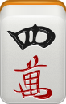
  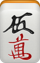
  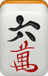
  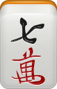
  
  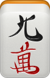

### Círculos

  
  
  
  
  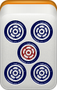
  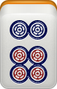
  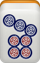
  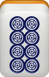
  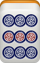

### Bambú

  
  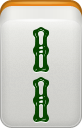
  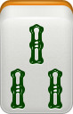
  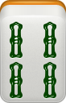
  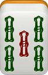
  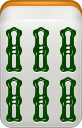
  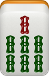
  
  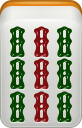

Además, existen **7 tipos de honores**.

### Vientos

  

    
    Este
  

  

    
    Sur
  

  

    
    Oeste
  

  

    
    Norte
  

### Dragones

  

    
    Blanco
  

  

    
    Verde
  

  

    
    Rojo
  

Los honores no tienen una secuencia numérica y, por tanto, **no pueden formar secuencias**.

---
## Objetivo

El objetivo es completar una **mano ganadora**.

La estructura normal de una mano ganadora es:

- **4 grupos**
- **1 pareja**

Cada grupo puede ser una **secuencia**, un **trío** o un **grupo de cuatro fichas iguales**.

### Secuencia

Tres fichas consecutivas del mismo palo.

  
  
  

### Trío

Tres fichas exactamente iguales.

  
  
  

### Grupo de cuatro

Cuatro fichas exactamente iguales.

  
  
  
  

Un grupo de cuatro fichas iguales cuenta como **un único grupo**.

Más adelante veremos cómo estos grupos pueden declararse como **Gang** durante la partida.

### Pareja

Dos fichas exactamente iguales.

  
  

!!! note "Ten en cuenta"
    Algunas manos ganadoras tienen una estructura diferente y no necesitan estar formadas por 4 grupos y 1 pareja.

    Estas manos se explican en **Manos y puntuación**.

!!! warning "Importante"
    No se puede utilizar el descarte de otro jugador para completar una secuencia.

    Los descartes de otros jugadores sí pueden utilizarse para completar determinados grupos mediante acciones llamadas **Pong y Gang**, que se explican más adelante.
    
---

## Preparación

### Número de jugadores

Se puede jugar con **3 o 4 jugadores**, siendo **4 jugadores la configuración recomendada**.

La partida no tiene una duración fija. Se juegan tantas manos como se quiera y termina cuando los jugadores decidan dejar de jugar.

### Primer repartidor

Al comenzar la partida, cada jugador tira **un dado**.

El jugador que obtenga el número más alto será el primer repartidor.

Si varios jugadores empatan con el número más alto, únicamente los jugadores empatados vuelven a tirar. Se repite hasta obtener un único repartidor.

En las siguientes manos:

- Si hay un ganador, **será el repartidor de la siguiente mano**.
- Si hay varios ganadores, el repartidor se determina según la regla explicada en **Final de una mano**.
- Si nadie gana, **se mantiene el repartidor actual**.

---

## Construcción del muro

Todas las fichas se colocan boca abajo y se mezclan.

Después se construyen **4 muros**.

Cada muro está formado por:

- **17 fichas de largo**
- **2 fichas de alto**

Cada muro contiene 34 fichas. Entre los cuatro muros se utilizan las **136 fichas**.

### Con 4 jugadores

Cada jugador construye el muro situado delante de él.

### Con 3 jugadores

También se construyen los **4 muros completos**.

Cada jugador construye el muro situado delante de él y el cuarto muro se construye entre los jugadores.

### Apertura del muro

Una vez construidos los cuatro muros, el **repartidor tira un dado** para determinar por dónde comienza el reparto.

1. Se toma el número obtenido en el dado.
2. Empezando por el muro del propio repartidor, se cuentan los muros en **sentido antihorario**.
3. En el muro seleccionado, se cuentan tantas columnas como indique el dado, esta vez en **sentido horario**.
4. El muro se separa en ese punto.
5. El repartidor comienza a tomar las fichas a partir de esa apertura.

!!! note "Por ejemplo"
    Si el repartidor obtiene un **3**, cuenta tres muros en sentido antihorario empezando por el suyo.

    En el muro seleccionado cuenta **3 columnas en sentido horario**, separa el muro en ese punto y comienza el reparto desde la apertura.

---

## Dirección del juego

Durante la partida hay que distinguir dos direcciones:

- El muro se recorre en **sentido horario**.
- Los turnos avanzan en **sentido antihorario**.

!!! note "Ten en cuenta"
    **Las fichas se roban siguiendo las agujas del reloj, pero los jugadores juegan en sentido contrario.**

---

## Reparto inicial

El reparto se realiza directamente desde el muro.

Las fichas se toman inicialmente en grupos de **4**.

Cada jugador toma:

1. **4 fichas**.
2. Otras **4 fichas**.
3. Otras **4 fichas**.

Después de estas tres vueltas, cada jugador tiene **12 fichas**.

A continuación, cada jugador toma **1 ficha más**, llegando a 13.

Finalmente, el repartidor toma **una ficha adicional**.

| Jugador | Fichas iniciales |
| --- | ---: |
| Repartidor | **14** |
| Demás jugadores | **13** |

---
## Desarrollo del juego

Durante la mano, cada jugador va construyendo su mano mediante el ciclo de **robar y descartar fichas**.

Las secuencias, tríos y parejas pueden formarse simplemente conservando las fichas necesarias que se van robando. Estos grupos permanecen en la mano del jugador y no es necesario declararlos.

Además, existen **Pong y Gang**, que permiten formar determinados grupos mediante acciones especiales durante la partida.

!!! note "Ten en cuenta"
    Una secuencia, un trío o una pareja que hayas formado con tus propios robos **no se declara ni se coloca sobre la mesa**. Las fichas simplemente permanecen en tu mano hasta el final.

### Pong y Gang

Durante el juego existen dos acciones que permiten formar grupos de una forma distinta a simplemente robar las fichas necesarias.

Un **Pong** consiste en reclamar la ficha que acaba de descartar otro jugador para completar un trío.

Un **Gang** está formado por cuatro fichas iguales. Dependiendo de cómo se consiga, puede declararse durante el propio turno o utilizando el descarte de otro jugador.

Por ahora basta con conocer estas dos acciones. Los distintos tipos de Gang, cuándo puede declararse cada uno, su colocación y sus pagos se explican en detalle en **Pong y Gang**.

!!! warning "Importante"
    Un descarte puede utilizarse para hacer Pong o determinados tipos de Gang, pero **nunca para completar una secuencia**.

### Durante tu turno

Normalmente, un turno sigue este orden:

1. **Robar 1 ficha** del muro.
2. **Actuar**, si corresponde.
3. **Descartar 1 ficha**.

!!! note "En resumen"
    **Robar → actuar → descartar**

    Cuando, siguiendo el orden normal de juego, todos los jugadores han tenido un turno, se ha completado una **ronda**.

Durante la fase de actuar, el jugador puede, entre otras posibilidades:

- Declarar determinados tipos de **Gang**.
- Declarar una **victoria** si la ficha robada completa su mano.
- No realizar ninguna acción y continuar directamente con el descarte.

### Durante el turno de otro jugador

Un jugador también puede actuar como respuesta a una ficha que otro jugador acaba de descartar.

Dependiendo de la situación, puede:

- Hacer **Pong**.
- Hacer un **Gang** utilizando el descarte.
- Declarar una **victoria** con ese descarte.

Por tanto, aunque los turnos siguen un orden, **hay acciones que pueden realizarse durante el turno de otro jugador**.

!!! note "Ten en cuenta"
    Reclamar un descarte mediante Pong o Gang puede alterar el orden normal de juego y hacer que se salten uno o varios jugadores.

    Su funcionamiento se explica en detalle en **Pong y Gang**.

### Inicio de la mano

Durante los primeros turnos puede producirse una regla especial relacionada con los descartes.

!!! warning "Seguir la corriente"
    Si el **primer descarte de un jugador** es seguido, de forma consecutiva, por los otros tres jugadores descartando exactamente la misma ficha, el jugador que inició la secuencia paga **1 punto a cada uno de ellos**.

    Solo el descarte que inicia la secuencia tiene que ser el **primer descarte de ese jugador**. Los otros jugadores pueden haber descartado anteriormente.

    Esta regla solo puede producirse mientras no se haya realizado ningún **Pong o Gang abierto**.

    En cuanto se realiza un Pong o Gang abierto, **Seguir la corriente deja de poder activarse durante el resto de la mano**.

!!! note "Por ejemplo"
    C realiza su primer descarte y tira un **5 de bambú**.

    Después D, A y B descartan consecutivamente también un **5 de bambú**.

    C paga **1 punto a cada uno de los otros tres jugadores**.

---

## Cómo ganar

Cuando a un jugador le falta únicamente una ficha para completar una mano ganadora, se dice que está **en espera**.

Los distintos tipos de ficha que permiten completar una mano en espera se llaman **salidas**.

Una mano puede tener una o varias salidas.

!!! note "Por ejemplo"
    Si un jugador está en espera y puede completar su mano con un **3 de círculos** o un **6 de círculos**, tiene **2 salidas**.

Una mano en espera puede completarse de dos formas: mediante **autorrobo** o mediante el **descarte de otro jugador**.

No todas las manos permiten ambas formas de victoria. Esto se indica para cada una en **Manos y puntuación**.

### Autorrobo

El jugador roba del muro la ficha que completa su mano.

La victoria se declara **inmediatamente después de robar y antes de descartar**.

En un autorrobo, **cada uno de los demás jugadores paga al ganador** la puntuación correspondiente a la mano.

!!! note "Por ejemplo"
    Una mano vale **2 puntos por autorrobo** y están jugando 4 jugadores.

    Cada uno de los tres rivales paga 2 puntos, por lo que el ganador recibe **6 puntos en total**.

### Victoria por descarte

Otro jugador descarta la ficha que completa la mano del ganador.

La victoria debe declararse **inmediatamente después del descarte**.

En este caso, **solo paga el jugador responsable del descarte**.

!!! note "Por ejemplo"
    Si una mano vale **6 puntos por victoria mediante descarte**, el jugador que realizó ese descarte paga los **6 puntos completos**.

    Los demás jugadores no pagan por esa victoria.

---

## Prioridad de la victoria

Una declaración de victoria tiene **prioridad sobre un Pong o Gang**.

Si una misma ficha descartada permite a un jugador ganar y a otro reclamarla para formar un Pong o Gang, se resuelve primero la victoria.

!!! warning "Una ficha, varias victorias"
    Un mismo descarte puede completar la mano de **varios jugadores simultáneamente**.

    En ese caso, todos los jugadores que tengan una mano válida pueden declarar la victoria.

    El jugador responsable del descarte paga **por separado la puntuación completa de cada ganador**.

!!! note "Por ejemplo"
    Un jugador descarta una ficha que permite ganar a otros dos jugadores.

    Una de las manos vale **6 puntos** y la otra **12 puntos**.

    El responsable del descarte paga **6 puntos a un ganador y 12 puntos al otro**.

---

## Final de una mano

Cuando se declara una victoria válida, **la mano termina inmediatamente**.

Ya no se realizan más turnos.

Se comprueban las manos ganadoras, se calcula su puntuación y se realizan los pagos correspondientes.

El ganador será el **repartidor de la siguiente mano**.

Si hay varios ganadores, será repartidor el jugador cuya mano tenga la **mayor puntuación**.

Si varios ganadores empatan con la mayor puntuación, únicamente los jugadores empatados tiran un dado. El que obtenga el número más alto será el repartidor.

Si vuelven a empatar con el número más alto, vuelven a tirar hasta obtener un único repartidor.

### Final del muro

Al llegar al final del muro se aplica una regla especial.

!!! warning "Pescar la luna en el fondo del mar"
    Cuando quedan tantas fichas en el muro como jugadores haya en la partida, no se continúa con los turnos normales.

    Cada jugador toma **una de las últimas fichas simultáneamente**.

    Por tanto, se utilizan las **4 últimas fichas** en una partida de 4 jugadores y las **3 últimas fichas** en una partida de 3 jugadores.

    Todos los jugadores cuya ficha complete una mano válida pueden ganar.

    La puntuación de cada mano ganadora se **multiplica por 1,5**.

    Si el resultado no es un número entero, se **redondea al entero más cercano**. En caso de terminar exactamente en ,5, se redondea hacia arriba.

### Si nadie gana

Si después de resolver **Pescar la luna en el fondo del mar** nadie consigue una mano ganadora:

- La mano termina sin ganador.
- Se anulan todos los pagos de esa mano.
- El repartidor se mantiene.
- Se mezclan de nuevo las fichas y comienza una nueva mano.
