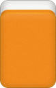

# Pong y Gang

Durante una mano, normalmente los grupos se van formando con las fichas que cada jugador roba del muro.

Sin embargo, existen dos acciones que permiten formar o declarar grupos durante el juego: **Pong** y **Gang**.

Estas acciones pueden modificar el desarrollo normal de los turnos y, en el caso de los Gang, generar puntos adicionales.

---

## Pong

Un **Pong** permite utilizar la ficha que acaba de descartar otro jugador para completar un trío.

Para poder hacerlo, el jugador debe tener ya en su mano **dos fichas iguales** a la que acaba de ser descartada.

Al declarar un Pong:

1. Se reclama la ficha descartada.
2. Se muestran las dos fichas iguales que ya se tenían.
3. Las tres fichas se colocan juntas y boca arriba sobre la mesa.
4. El jugador descarta una ficha de su mano.

Al hacer Pong **no se roba del muro**.

Después del descarte, el juego continúa normalmente desde el jugador que ha realizado el Pong, en sentido antihorario.

!!! note "Ten en cuenta"
    Un Pong puede realizarse con el descarte de **cualquier jugador**, no únicamente con el del jugador anterior.

    Por este motivo, al realizar un Pong pueden saltarse uno o varios turnos.

### Colocación del Pong

Las tres fichas se colocan juntas, **boca arriba y rectas**.

  
  
  

No es necesario indicar qué jugador proporcionó la ficha.

---

## Gang

Un **Gang** está formado por cuatro fichas iguales y cuenta como **un único grupo** dentro de la mano.

Existen tres tipos:

- **Gang abierto**
- **Gang oculto**
- **Gang añadido**

La forma de conseguirlo determina cómo se declara, cómo se coloca y qué puntos genera.

Siempre que se declara un Gang, el jugador roba una **ficha suplementaria** antes de continuar su turno.

---

## Gang abierto

Un **Gang abierto** se produce cuando un jugador tiene tres fichas iguales en su mano y otro jugador descarta la cuarta.

Al declararlo:

1. Se reclama la ficha descartada.
2. Se muestran las tres fichas iguales que ya se tenían.
3. Las cuatro fichas se colocan sobre la mesa.
4. Se registra un pago de **2 puntos** a cargo del jugador que realizó el descarte.
5. Se roba una **ficha suplementaria**.
6. Se continúa el turno y finalmente se descarta una ficha.

Al igual que con un Pong, reclamar este descarte puede provocar que se salten jugadores.

### Colocación del Gang abierto

Las cuatro fichas se colocan **boca arriba**.

La ficha procedente del descarte se coloca de forma que permita recordar qué jugador la proporcionó.

Si el descarte procede del jugador de enfrente, las cuatro fichas permanecen rectas.

Si procede de uno de los jugadores situados a los lados, la ficha correspondiente se coloca orientada hacia ese jugador.

!!! note "Ten en cuenta"
    Esta colocación permite recordar al finalizar la mano que se trata de un **Gang abierto** e identificar al jugador que, si existe al menos un ganador, debe pagar **2 puntos**.

---

## Gang oculto

Un **Gang oculto** se produce cuando un jugador consigue las cuatro fichas iguales mediante sus propios robos.

No es obligatorio declararlo inmediatamente al conseguir la cuarta ficha.

El jugador puede conservar las cuatro fichas en su mano y declarar el Gang oculto durante cualquiera de sus turnos posteriores.

Al declararlo:

1. Se colocan las cuatro fichas como Gang oculto.
2. Se registra un pago de **2 puntos de cada rival**.
3. Se roba una **ficha suplementaria**.
4. Se continúa el turno y finalmente se descarta una ficha.

### Colocación del Gang oculto

Las dos fichas centrales se colocan **boca arriba** y las dos fichas de los extremos **boca abajo**.

  
  
  
  

!!! note "Ten en cuenta"
    Esta disposición permite recordar al finalizar la mano que se trata de un **Gang oculto** y que, si existe al menos un ganador, corresponde un pago de **2 puntos de cada rival**.

---

## Gang añadido

Un **Gang añadido** se forma a partir de un Pong que ya está colocado sobre la mesa.

Si posteriormente el jugador consigue por sus propios robos la cuarta ficha correspondiente, puede añadirla al Pong y convertirlo en un Gang.

No es obligatorio hacerlo inmediatamente. La cuarta ficha puede conservarse en la mano y declararse en un turno posterior.

Al declararlo:

1. Se añade la cuarta ficha al Pong.
2. Se registra un pago de **1 punto de cada rival**.
3. Se roba una **ficha suplementaria**.
4. Se continúa el turno y finalmente se descarta una ficha.

!!! warning "Robar el Gang"
    Cuando un jugador intenta convertir un Pong en un **Gang añadido**, otro jugador puede utilizar esa cuarta ficha para completar una mano ganadora.

    En ese caso, la victoria se declara antes de que el Gang llegue a completarse.

    El jugador que intentaba declarar el Gang añadido es el responsable del pago, como si hubiera proporcionado la ficha ganadora mediante un descarte.

    La puntuación de la mano ganadora se **multiplica por 1,5**.

    Si el resultado no es entero, se redondea al entero más cercano. En caso de terminar exactamente en ,5, se redondea hacia arriba.

    Como el Gang añadido queda interrumpido, **no llega a completarse**.

    Por tanto, no se registra su pago de **1 punto de cada rival** ni se roba una ficha suplementaria.

### Colocación del Gang añadido

Las tres fichas del Pong permanecen boca arriba y la cuarta ficha añadida se coloca **boca abajo**.

  
  
  
  

!!! note "Ten en cuenta"
    Esta disposición permite recordar al finalizar la mano que se trata de un **Gang añadido** y que, si existe al menos un ganador, corresponde un pago de **1 punto de cada rival**.

---

## Ficha suplementaria

Cada vez que se declara cualquiera de los tres tipos de Gang, el jugador debe robar **una ficha suplementaria**.

Esta ficha se toma desde la **parte trasera del muro**, en lugar de continuar desde el extremo utilizado para los robos normales.

Después de robarla, el jugador continúa su turno.

!!! warning "Florecer sobre el Gang"
    Si la ficha suplementaria completa una mano ganadora, la puntuación de esa mano se **multiplica por 1,5**.

    Si el resultado no es entero, se redondea al entero más cercano. En caso de terminar exactamente en ,5, se redondea hacia arriba.

---

## Mano abierta y mano cerrada

Una mano se considera **cerrada** mientras no se haya utilizado el descarte de otro jugador para formar un grupo.

La mano se **abre** cuando el jugador incorpora a su mano una ficha descartada por otro jugador para formar un grupo.

Por tanto:

- Hacer **Pong** abre la mano.
- Hacer un **Gang abierto** abre la mano.
- Hacer un **Gang oculto** no abre la mano, ya que sus cuatro fichas proceden de los propios robos.
- Un **Gang añadido** parte de un Pong, por lo que la mano ya estaba abierta.

!!! warning "Importante"
    Un **Gang oculto no rompe la condición de mano cerrada**, aunque sus cuatro fichas se coloquen sobre la mesa.

Una vez que una mano está abierta, permanece abierta durante el resto de esa mano.

---

## Pagos de los Gang

Los Gang generan puntos adicionales que se registran durante la partida.

| Tipo de Gang | Pago |
| --- | ---: |
| Gang abierto | **2 puntos** del jugador que descartó |
| Gang oculto | **2 puntos de cada rival** |
| Gang añadido | **1 punto de cada rival** |

Estos puntos **no se pagan inmediatamente**. La colocación de los Gang permite recordar los pagos pendientes al finalizar la mano.

Si la mano termina con al menos un ganador o una **Falsa victoria**, se hacen efectivos los pagos de los Gang correspondientes.

Si la mano termina sin ganador y sin Falsa victoria, **todos los pagos de Gang quedan anulados**.

!!! note "Por ejemplo"
    Un jugador declara un Gang oculto durante una mano de 4 jugadores.

    Si la mano termina con un ganador, cada uno de sus tres rivales le paga **2 puntos**, por lo que recibe **6 puntos** por ese Gang.

    Si la mano termina sin ganador, no recibe ningún punto.